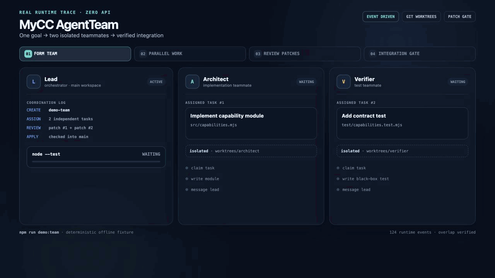
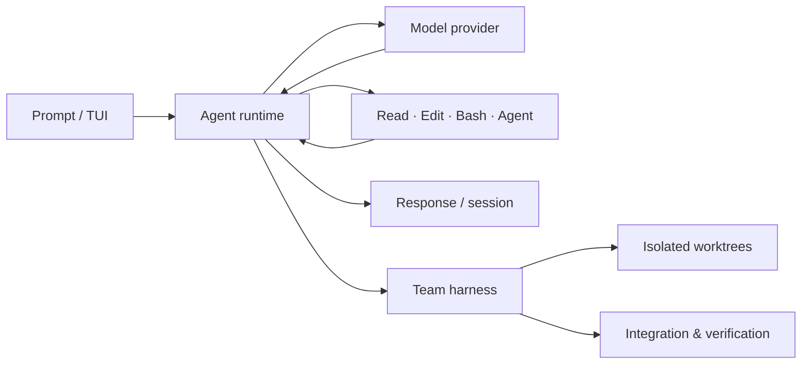

<div align="center">
  <h1>MyCC</h1>
  <p><strong>一个可运行的 coding agent runtime，以及面向真实协作约束的多智能体 harness。</strong></p>
  <p>
    <a href="#-快速开始">快速开始</a> ·
    <a href="#-它解决什么问题">能力概览</a> ·
    <a href="#-多智能体协作">多智能体协作</a>
  </p>
  <p>
    
    
    
    
  </p>
</div>

<p align="center">
  
</p>

<p align="center"><sub>真实 <code>TeamSession</code> 事件驱动：Lead 创建团队，两个 teammate 在隔离 worktree 并行交付 patch，经审查合入后通过测试门禁；<code>npm run demo:team</code> 可离线复现，不需要 API Key。</sub></p>

---

## ✨ 它解决什么问题

MyCC 把一个 coding agent 必须具备的基础运行时能力，与可审计的团队协作机制放在同一仓库中：既可以在终端中完成单 agent 的「模型 → 工具 → 结果回流」循环，也可以把多个 agent 放进隔离 worktree，按依赖关系并发执行、合并并验证。

| 层次 | 关注点 | 入口 |
| --- | --- | --- |
| `runtime/` | Agent loop、流式响应、工具系统、权限、上下文压缩、会话恢复与 TUI | [`runtime/cli.mjs`](../runtime/cli.mjs) |
| `multiagent/` | 串行/显式 DAG 编排、共享状态、隔离 worktree、trace 与 MultiAgentBench 入口 | [`multiagent/README.md`](../multiagent/README.md) |

仓库不提交本地评测数据、日志或运行产物。需要任务数据的评测由使用者在本地提供，运行产物默认位于忽略的目录中。



## 🚀 快速开始

**环境要求：** Node.js `20+`。项目没有运行时 npm 依赖，clone 后建议先跑 AgentTeam 离线 demo：

```bash
git clone https://github.com/yuhuping/MyCC.git
cd MyCC

# 两个 teammate 并行工作、交付 patch，并由 lead 集成验证
npm run demo:team

# 单 Agent：验证模型 → 工具 → 结果回流
npm start -- --demo --prompt "Inspect this workspace"
```

运行交互式终端：

```bash
cp .env.example .env
# 在 .env 中填写 ANTHROPIC_API_KEY
npm start -- --tui
```

也可以用离线 TUI 体验命令和工具回路：

```bash
npm start -- --tui --demo
```

## 🧠 Runtime 能力

- **完整工具回路**：多轮模型响应、工具调用、工具结果回流与最终回答。
- **可控的执行边界**：支持 `Read`、`Write`、`Edit`、`Glob`、`Grep`、`Bash` 与子 `Agent`，并由权限规则与 headless 拒绝策略约束执行。
- **面向长任务的恢复能力**：超时与瞬时错误重试、部分流恢复、输出 token 扩容、会话持久化与恢复。
- **上下文管理**：token budget、自动 compact 与历史消息压缩，避免长对话无界增长。
- **终端优先体验**：TUI 支持 `/help`、`/clear`、`/sessions`、`/exit`。

核心调用链：`runtime/cli.mjs` → `runtime/agent.mjs` → `runtime/tools.mjs`。

## 🤝 多智能体协作

MyCC 的 runtime 内置 AgentTeam 协作链路：`TeamCreate` / `Agent` / `TaskCreate` / `SendMessage` / `TaskUpdate` / `TeamApplyPatch` / `TeamDelete`。每个 teammate 使用独立 Git worktree，交付物以 patch 进入 lead 的集成与测试门禁；离线演示还会验证两个任务在首个交付完成前均已开始，避免把串行执行误称为并行。

仓库同时保留历史的 relay 协作模式，并提供显式 DAG 模式。后者不从自然语言或 agent 关系“猜”任务依赖：计划、并发上限、结果文件和合并职责必须显式给出。

```text
relay（默认）     AgentGraph → 建码 → 审阅 → 优化 → solution / trace

planned（显式 DAG）execution plan → ready set 并发 → isolated worktrees
                                  → 唯一 main writer 合并 → 测试门禁 → lifecycle trace
```

启用 Agent Team 后，lead 与队友复用同一 runtime；队友在 `.mycc/teams/<team>/` 的 detached worktree 工作。普通文本不会直接作为用户回答，必须经由团队消息和任务状态向 lead 汇报，再由 lead 应用 patch：

```bash
node runtime/cli.mjs --team --prompt "并行完成这个修复" --max-teammates 4
```

运行需要外部任务数据与 Responses API 配置的 MultiAgentBench coding 任务：

```bash
node multiagent/run-mab.mjs \
  --data /path/to/MARBLE/multiagentbench/coding/coding_main.jsonl \
  --task-ids 1-5 \
  --max-turns 25 \
  --skip-existing
```

更多协作参数、结果结构和不同协调模式见 [`multiagent/README.md`](../multiagent/README.md)。

## ✅ 验证

```bash
npm test
```

该命令运行 multi-agent 与 team 的离线 smoke test；它不需要模型密钥，也不产生可提交的评测结论。

## ⚙️ 配置

最小模型配置：

```dotenv
ANTHROPIC_API_KEY=your-api-key
MYCC_MODEL=claude-sonnet-4-6
MYCC_API_BASE_URL=https://api.anthropic.com
```

Multi-Agent Responses API 为可选配置，详见 [`.env.example`](../.env.example)。不要提交真实密钥；`.env` 已被 Git 忽略。

## 📄 License

当前仓库未附带开源许可证。如需公开分发，请先补充与你拥有的代码和依赖相匹配的许可证声明。
